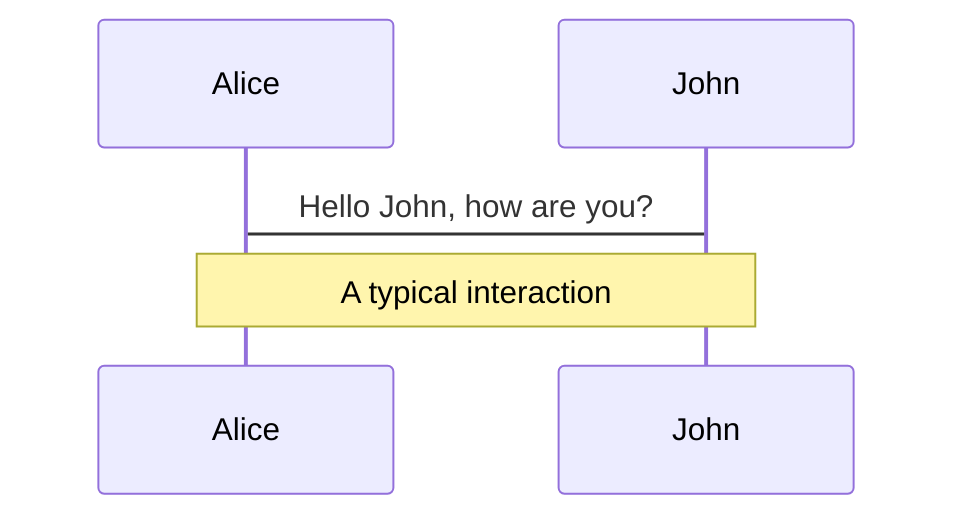
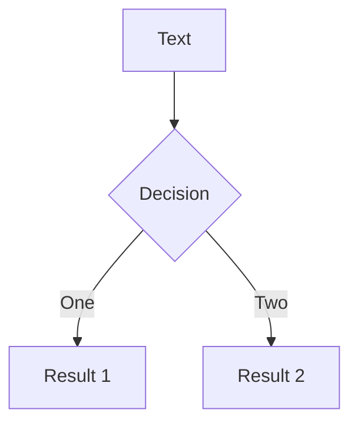
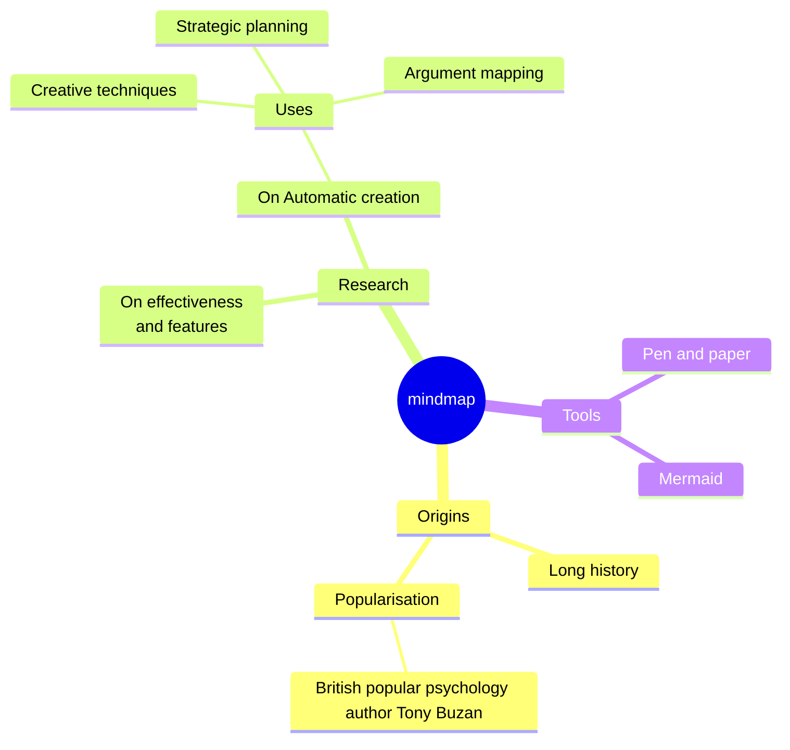
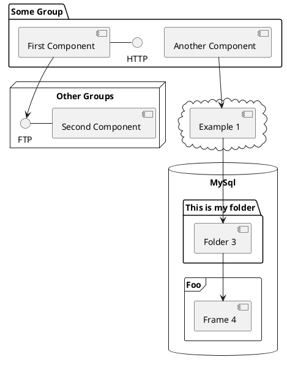

---
# try also 'default' to start simple
theme: default
title: '魔法色彩: 探索颜色原理'
info: |
  ## Magic Color Space.

  Learn more at [Magic Color](https://github.com/zyyv/magic-color)
class: text-center
highlighter: shiki
drawings:
  persist: true
transition: slide-left
mdc: true
---

<div fbc pr-20>

<h1 flex="~ col">
  <div flex gap-3 font-ubuntu grad-p-r>Magic Color</div>
  <div flex="~ gap3" items-center>魔法色彩</div>
  <div flex="~ gap3" items-center>探索颜色原理</div>
</h1>

<div flex justify-center items-center relative>
  <div id="logo" absolute top='1/2' left='1/2' translate='-1/2'  w-60 h-60  hover-op-0 transition duration-1000
bg-gradient-to-r shape="[-45deg]" from="$vp-c-brand" to="#009ff7" blur-120px rd-full>
  </div>
  
</div>

</div>

<div abs-bl mx-13 my-12 flex="~ col" text-sm text-left>
  <div grad-color tracking-widest op50>
    Chris
  </div>
  <div>Share Meeting</div>
  <div text-sm opacity-50>April 17th, 2024</div>
</div>

---
transition: fade-out
layout: intro
growX: 10
growY: 90
style: 'padding-left: 8rem;'
---

<Avatar />

<div prose>
  <p>
  <i i-fluent-emoji-sparkles mr-1 />
  Team member of
  <IconsUnoCSS />
  ,
  <IconsElk />
  , Creator of
  <IconsOnuUI />
  ,
  <IconsUnPreset />
  <i i-fluent-emoji-sparkles ml-1 />
  </p>
  <p>
  In the community, I am also a ecological contributors of the
  <IconsVite />
  、
  <IconsVue />
  、
  <IconsNuxt /> & etc.
  </p>
</div>

<div mt-10 fsc gap-4>
  <div fsc gap-2>
    <div i-carbon-user-sponsor op50 text-xl/>
    <div><a href="https://zyob.top" target="_blank" class="border-none! font-300">zyob.top</a></div>
  </div>
  <div fsc gap-2>
    <div i-carbon-logo-github op50 text-xl/>
  <div><a href="https://github.com/zyyv" target="_blank" class="border-none! font-300">zyyv</a></div>
  </div>
  <div fsc gap-2>
    <div i-carbon-logo-twitter op50 ma text-xl/>
    <div><a href="https://twitter.com/chris_zyyv" target="_blank" class="border-none! font-300">chris_zyyv</a></div>
  </div>
</div>

---
transition: slide-up
---

# 回顾「颜色」

你所认识的颜色？

<v-clicks>

- **光学三原色**：<span inline-block w-4 h-4 mr-1 class="bg-[red]" ></span> 红、<span inline-block w-4 h-4 mr-1 class="bg-#0f0"></span> 绿、<span inline-block w-4 h-4 mr-1 class="bg-#00f"></span> 蓝。通常作用于 `RGB模式` 应用于生活的方方面面。

- **美术三原色**：<span inline-block w-4 h-4 mr-1 class="bg-[cyan]" ></span> 青、<span inline-block w-4 h-4 mr-1 class="bg-[magenta]"></span> 品红、<span inline-block w-4 h-4 mr-1 class="bg-[yellow]"></span> 黄。通常作用于 `RYB模式` 在艺术、设计和绘画中都有广泛的使用场景 。

- **七彩或彩虹色**：<span inline-block w-4 h-4 mr-1 class="bg-[red]"></span>红（赤）、
<span inline-block w-4 h-4 mr-1 class="bg-[orange]"></span>橙、
<span inline-block w-4 h-4 mr-1 class="bg-[yellow]"></span>黄、
<span inline-block w-4 h-4 mr-1 class="bg-[green]"></span>绿、
<span inline-block w-4 h-4 mr-1 class="bg-[cyan]"></span>青、
<span inline-block w-4 h-4 mr-1 class="bg-[blue]"></span>蓝、
<span inline-block w-4 h-4 mr-1 class="bg-[purple]"></span>紫、

- ...

</v-clicks>

<div pcc pf v-show="$slidev.nav.clicks === 1">
  
</div>

<div pcc pf mt-10 v-show="$slidev.nav.clicks === 2">
  
</div>

---
transition: fade-out
---

# CSS颜色值

在 CSS（层叠样式表）中，颜色用于定义网页元素的外观。

在 CSS 中，可以使用以下几种方法来指定颜色：

<v-clicks>

- **关键词颜色值（Keyword）**：一些常见的颜色名称，比如"red"（红色）、"blue"（蓝色）等。

- **十六进制颜色值（Hexadecimal）**：使用六位十六进制数字来表示颜色，如"#FF0000"代表红色，其中每两位代表红、绿、蓝色的分量。

- **RGB颜色值（RGB）**：使用红（Red）、绿（Green）、蓝（Blue）三个通道的数值来定义颜色，例如"rgb(255, 0, 0)"表示红色。

- **HSL颜色值（HSL）**：使用色相（Hue）、饱和度（Saturation）、亮度（Lightness）来定义颜色，例如"hsl(0, 100%, 50%)"表示红色。

- **HSB颜色值（HSB Color Values）**：HSB颜色模型中，色相（Hue）、饱和度（Saturation）、亮度（Brightness）分别表示颜色的类型、纯度和明度。

</v-clicks>

---
transition: slide-right
level: 2
clicks: 3
---

# KeyWord

关键词可以直接用于设置元素的文本颜色、背景颜色等。

<div v-show="$slidev.nav.clicks < 3">

````md magic-move
```css
/* css */
div {
  color: red;
  background-color: lightblue;
}
```
```html
<!-- html -->
<div style="color: red; background-color: lightblue;">KeyWord Color</div>
```
```ts
// typescript
div.style.color = 'red';
div.style.backgroundColor = 'lightblue';
```
````

</div>

<div  v-show="$slidev.nav.clicks === 3">

#### 预定义颜色（第三方）

<div max-h-80 of-auto rd-md>

```ts {monaco-run}
import { KeywordColors, UnoColors } from 'magic-color'

console.log(KeywordColors)
```

</div>

</div>

---
transition: slide-left
level: 2
layout: two-cols
layoutClass: gap-16
---

# RBG Color

RGB（红绿蓝）是一种常用的颜色表示方法，它基于光的加色混合原理

在RGB模型中，每种颜色都是通过不同比例的红、绿、蓝三种颜色的混合而得到的。每种颜色的取值范围为0到255，其中0表示没有颜色，255表示颜色的最大强度。

<Rgb />

::right::
1

---
transition: slide-left
level: 2
layout: two-cols
layoutClass: gap-16
---

# Hexadecimal Color

十六进制颜色值是最常用的颜色表示方法之一。

十六进制颜色值由六位十六进制数字组成，每两位代表红、绿、蓝色的分量。

```css
/* css */
div {
  color: #FF0000;
  background-color: #00FF00;
}
```

::right::
1
<!-- # Table of contents

You can use the `Toc` component to generate a table of contents for your slides:

```html
<Toc minDepth="1" maxDepth="1"></Toc>
```

The title will be inferred from your slide content, or you can override it with `title` and `level` in your frontmatter.

::right::

<Toc v-click minDepth="1" maxDepth="2"></Toc> -->

---
layout: image-right
image: https://cover.sli.dev
---

# Code

Use code snippets and get the highlighting directly, and even types hover![^1]

```ts {all|5|7|7-8|10|all} twoslash
// TwoSlash enables TypeScript hover information
// and errors in markdown code blocks
// More at https://shiki.style/packages/twoslash

import { computed, ref } from 'vue'

const count = ref(0)
const doubled = computed(() => count.value * 2)

doubled.value = 2
```

<arrow v-click="[4, 5]" x1="350" y1="310" x2="195" y2="334" color="#953" width="2" arrowSize="1" />

<!-- This allow you to embed external code blocks -->
<<< @/snippets/external.ts#snippet

<!-- Footer -->
[^1]: [Learn More](https://sli.dev/guide/syntax.html#line-highlighting)

<!-- Inline style -->
<style>
.footnotes-sep {
  @apply mt-5 opacity-10;
}
.footnotes {
  @apply text-sm opacity-75;
}
.footnote-backref {
  display: none;
}
</style>

<!--
Notes can also sync with clicks

[click] This will be highlighted after the first click

[click] Highlighted with `count = ref(0)`

[click:3] Last click (skip two clicks)
-->

---
level: 2
---

# Shiki Magic Move

Powered by [shiki-magic-move](https://shiki-magic-move.netlify.app/), Slidev supports animations across multiple code snippets.

Add multiple code blocks and wrap them with <code>````md magic-move</code> (four backticks) to enable the magic move. For example:

````md magic-move
```ts {*|2|*}
// step 1
const author = reactive({
  name: 'John Doe',
  books: [
    'Vue 2 - Advanced Guide',
    'Vue 3 - Basic Guide',
    'Vue 4 - The Mystery'
  ]
})
```

```ts {*|1-2|3-4|3-4,8}
// step 2
export default {
  data() {
    return {
      author: {
        name: 'John Doe',
        books: [
          'Vue 2 - Advanced Guide',
          'Vue 3 - Basic Guide',
          'Vue 4 - The Mystery'
        ]
      }
    }
  }
}
```

```ts
// step 3
export default {
  data: () => ({
    author: {
      name: 'John Doe',
      books: [
        'Vue 2 - Advanced Guide',
        'Vue 3 - Basic Guide',
        'Vue 4 - The Mystery'
      ]
    }
  })
}
```

Non-code blocks are ignored.

```vue
<!-- step 4 -->
<script setup>
const author = {
  name: 'John Doe',
  books: [
    'Vue 2 - Advanced Guide',
    'Vue 3 - Basic Guide',
    'Vue 4 - The Mystery'
  ]
}
</script>
```
````

---

# Components

<div grid="~ cols-2 gap-4">
<div>

You can use Vue components directly inside your slides.

We have provided a few built-in components like `<Tweet/>` and `<Youtube/>` that you can use directly. And adding your custom components is also super easy.

```html
<Counter :count="10" />
```

<!-- ./components/Counter.vue -->
<Counter :count="10" m="t-4" />

Check out [the guides](https://sli.dev/builtin/components.html) for more.

</div>
<div>

```html
<Tweet id="1390115482657726468" />
```

<Tweet id="1390115482657726468" scale="0.65" />

</div>
</div>

<!--
Presenter note with **bold**, *italic*, and ~~striked~~ text.

Also, HTML elements are valid:
<div class="flex w-full">
  <span style="flex-grow: 1;">Left content</span>
  <span>Right content</span>
</div>
-->

---
class: px-20
---

# Themes

Slidev comes with powerful theming support. Themes can provide styles, layouts, components, or even configurations for tools. Switching between themes by just **one edit** in your frontmatter:

<div grid="~ cols-2 gap-2" m="t-2">

```yaml
---
theme: default
---
```

```yaml
---
theme: seriph
---
```


</div>

Read more about [How to use a theme](https://sli.dev/themes/use.html) and
check out the [Awesome Themes Gallery](https://sli.dev/themes/gallery.html).

---

# Clicks Animations

You can add `v-click` to elements to add a click animation.

<div v-click>

This shows up when you click the slide:

```html
<div v-click>This shows up when you click the slide.</div>
```

</div>

<br>

<v-click>

The <span v-mark.red="3"><code>v-mark</code> directive</span>
also allows you to add
<span v-mark.circle.orange="4">inline marks</span>
, powered by [Rough Notation](https://roughnotation.com/):

```html
<span v-mark.underline.orange>inline markers</span>
```

</v-click>

<div mt-20 v-click>

[Learn More](https://sli.dev/guide/animations#click-animations)

</div>

---

# Motions

Motion animations are powered by [@vueuse/motion](https://motion.vueuse.org/), triggered by `v-motion` directive.

```html
<div
  v-motion
  :initial="{ x: -80 }"
  :enter="{ x: 0 }"
  :click-3="{ x: 80 }"
  :leave="{ x: 1000 }"
>
  Slidev
</div>
```

<div class="w-60 relative">
  <div class="relative w-40 h-40">
    
    
    
  </div>

  <div
    class="text-5xl absolute top-14 left-40 text-[#2B90B6] -z-1"
    v-motion
    :initial="{ x: -80, opacity: 0}"
    :enter="{ x: 0, opacity: 1, transition: { delay: 2000, duration: 1000 } }">
    Slidev
  </div>
</div>

<!-- vue script setup scripts can be directly used in markdown, and will only affects current page -->
<script setup lang="ts">
const final = {
  x: 0,
  y: 0,
  rotate: 0,
  scale: 1,
  transition: {
    type: 'spring',
    damping: 10,
    stiffness: 20,
    mass: 2
  }
}
</script>

<div
  v-motion
  :initial="{ x:35, y: 30, opacity: 0}"
  :enter="{ y: 0, opacity: 1, transition: { delay: 3500 } }">

[Learn More](https://sli.dev/guide/animations.html#motion)

</div>

---

# LaTeX

LaTeX is supported out-of-box powered by [KaTeX](https://katex.org/).

<br>

Inline $\sqrt{3x-1}+(1+x)^2$

Block
$$ {1|3|all}
\begin{array}{c}

\nabla \times \vec{\mathbf{B}} -\, \frac1c\, \frac{\partial\vec{\mathbf{E}}}{\partial t} &
= \frac{4\pi}{c}\vec{\mathbf{j}}    \nabla \cdot \vec{\mathbf{E}} & = 4 \pi \rho \\

\nabla \times \vec{\mathbf{E}}\, +\, \frac1c\, \frac{\partial\vec{\mathbf{B}}}{\partial t} & = \vec{\mathbf{0}} \\

\nabla \cdot \vec{\mathbf{B}} & = 0

\end{array}
$$

<br>

[Learn more](https://sli.dev/guide/syntax#latex)

---

# Diagrams

You can create diagrams / graphs from textual descriptions, directly in your Markdown.

<div class="grid grid-cols-4 gap-5 pt-4 -mb-6">









</div>

[Learn More](https://sli.dev/guide/syntax.html#diagrams)

---
foo: bar
dragPos:
  square: 596,130,136,_,-19
---

# Draggable Elements

Double-click on the draggable elements to edit their positions.

<br>

###### Directive Usage

```md

```

<br>

###### Component Usage

```md
<v-drag text-3xl>
  <carbon:arrow-up />
  Use the `v-drag` component to have a draggable container!
</v-drag>
```

<v-drag pos="653,300,253,_,-15">
  <div text-center text-3xl border border-main rounded>
    Double-click me!
  </div>
</v-drag>


---

---

# Monaco Editor

Slidev provides built-in Monaco Editor support.

Add `{monaco}` to the code block to turn it into an editor:

```ts {monaco}
import { ref } from 'vue'
import hello from './external'

const code = ref(hello())
```

Use `{monaco-run}` to create an editor that can execute the code directly in the slide:

```ts {monaco-run}
import { version } from 'vue'

function fibonacci(n: number): number {
  return n <= 1
    ? n
    : fibonacci(n - 1) + fibonacci(n - 2) // you know, this is NOT the best way to do it :P
}

console.log(version, Array.from({ length: 10 }, (_, i) => fibonacci(i + 1)))
```

---
layout: center
class: text-center
---

# Learn More

[Documentations](https://sli.dev) · [GitHub](https://github.com/slidevjs/slidev) · [Showcases](https://sli.dev/showcases.html)
